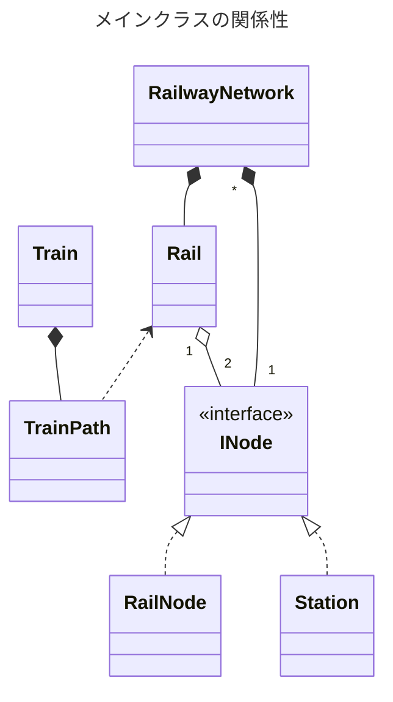
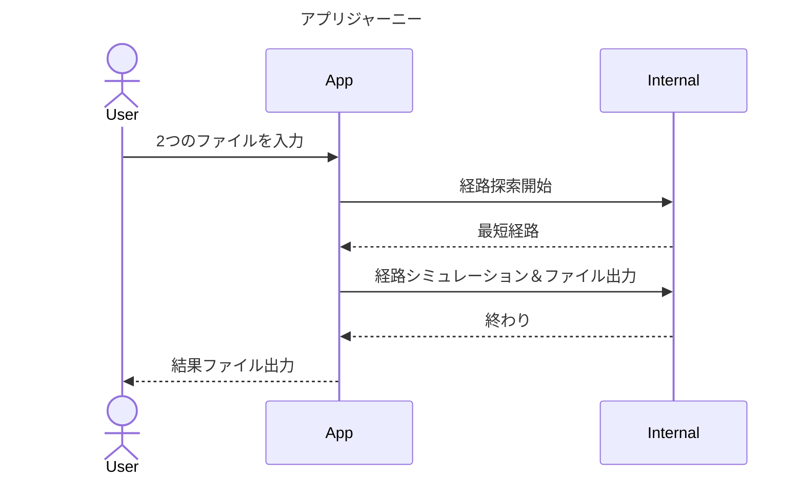
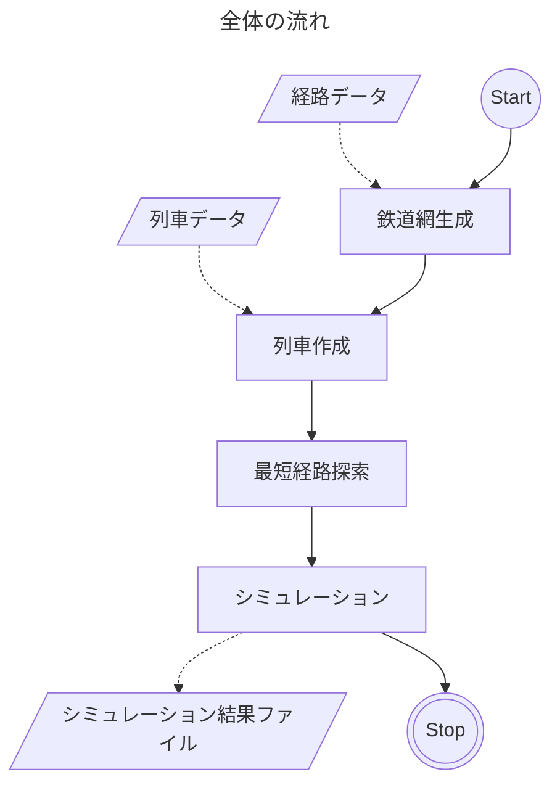

```mermaid
---
title: メインクラスの関係性
---
classDiagram

    RailwayNetwork *-- Rail

    Train *-- TrainPath

    Rail "1" o-- "2" INode
    Rail <.. TrainPath

    INode <|.. RailNode
    INode <|.. Station
    RailwayNetwork "*" *-- "1" INode

    class INode {
        <<interface>>
    }
```

```mermaid
---
title: アプリジャーニー
---
sequenceDiagram
    actor User
    participant App
    participant Internal
    User->>App: 2つのファイルを入力
    App->>Internal: 経路探索開始
    Internal-->>App: 最短経路
    App->>Internal: 経路シミュレーション＆ファイル出力
    Internal-->>App: 終わり
    App-->>User: 結果ファイル出力
```

```mermaid
---
title: 全体の流れ
---
flowchart
    IAAA@{ shape: lean-r, label: "経路データ" } -.-> BAA
    IBAA@{ shape: lean-r, label: "列車データ" } -.-> CAA
    EAA -.-> OAAA@{ shape: lean-r, label: "シミュレーション結果ファイル" }

    AAA@{ shape: circ, label: "Start" }
    --> BAA[鉄道網生成]
    --> CAA[列車作成]
    --> DAA[最短経路探索]
    --> EAA[シミュレーション]
    --> ZZZ@{ shape: dbl-circ, label: "Stop" }
```
